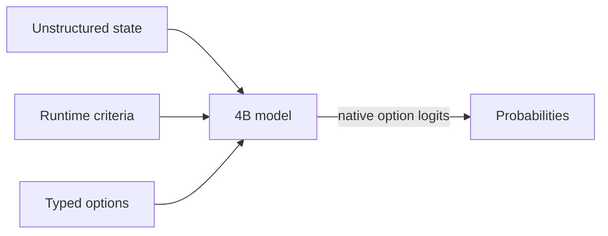

# fastjev

<div align="center">

**An SDK-first toolkit for fast, self-hosted semantic decisions with open models.**

*An independently maintained fork of [TheoLeeCJ/SemIf](https://github.com/TheoLeeCJ/SemIf).*

</div>

> **Fork lineage and independence.** fastjev preserves the Git history and MIT license of [SemIf](https://github.com/TheoLeeCJ/SemIf), formerly OpenJev, while following an independent roadmap. fastjev is not affiliated with or endorsed by TheoLeeCJ, TypeSafe, or Jev. Jev, TypeSafe, and other names and marks remain the property of their respective owners.

## Why fastjev

fastjev has three priorities, in this order:

- **SDK-first integration:** the public Python package is the primary interface for applications. CLI commands remain available for reproducibility, operations, and debugging.
- **Independent iteration:** maintainers can choose release timing, compatibility policy, and engineering priorities without waiting for upstream changes.
- **Faster inference:** generation-free scoring, resident model serving, measured cache reuse, and backend profiling are first-class priorities. Performance changes must include reproducible evidence and must not trade away decision quality silently.

Faster inference is a project direction, not an unqualified claim that every fastjev path is faster or more accurate than upstream, Jev, or another serving stack. The measurements below define the hardware, models, workloads, and known semantic differences. Historical benchmark artifacts and media retain SemIf/OpenJev names where renaming would invalidate checksums or misrepresent recorded runs.

Most agent decisions are small: *route this*, *retry that*, *does the evidence support X?* A chat model can answer them, but it spends time generating text that software immediately parses back into an `if` statement.

Jev is TypeSafe's closed service for runtime-defined semantic decisions. This project reproduces that **interface pattern** with open models; it does not reproduce Jev's undisclosed model or training.

This baseline reads typed option probabilities directly from a model. No answer sentence, JSON repair, or decoding loop.

### Current focus

- Serve the documented System One wire shape from a resident open model.
- Reduce decision latency without silently changing direct-scoring semantics.
- Keep model revisions, benchmark inputs, row-level outputs, and limitations auditable.

## SDK quick start

**Apple Silicon:** use the native [MLX backend](docs/MLX.md) for direct scoring,
serial prefix reuse, and parallel shared-state decisions on macOS arm64.
Install `pip install -e '.[test,mlx]'` and add `--backend mlx` to the scorer command.

Python 3.10+, CUDA, and a GPU that can hold a 4B BF16 model:

```bash
python -m venv .venv
. .venv/bin/activate
export HF_HOME=/path/to/large-drive/huggingface
pip install -e '.[test]'
```

Keep the loaded model resident and score runtime-defined decisions directly from Python:

```python
from fastjev import load_causal_model, score_direct

model, tokenizer, metadata = load_causal_model(
    "Qwen/Qwen3.5-4B",
    "851bf6e806efd8d0a36b00ddf55e13ccb7b8cd0a",
)
result = score_direct(
    model,
    tokenizer,
    {
        "id": "route-1",
        "state": "Customer cannot access an account after a password reset.",
        "question": "Which queue should handle this request?",
        "options": [
            {"id": "access", "description": "Account access support."},
            {"id": "billing", "description": "Billing support."},
        ],
    },
    metadata,
)
print(result["probabilities"])
```

The SDK also exports `SystemOneService` for in-process use of the documented System One request and response shape. Install `.[api]` and import `create_app` from `fastjev.http` only when an HTTP boundary is needed.

## CLI and service wrappers

Run the owned examples from a shell:

```bash
CUDA_VISIBLE_DEVICES=0 fastjev-score \
  --mode direct \
  --model Qwen/Qwen3.5-4B \
  --revision 851bf6e806efd8d0a36b00ddf55e13ccb7b8cd0a \
  --input examples/decisions.jsonl \
  --output results.jsonl
```

Each result contains typed option scores, timing, the exact model revision, and a prompt hash.

If every row has the same exact state, switch to `--mode shared` to prefill it once and evaluate the criteria in parallel.

### System One-compatible HTTP API

Install the `api` extra and run `fastjev-serve` to keep one model resident behind `POST /v1/systemone` and `GET /v1/models`. The adapter accepts TypeSafe's documented `state`, `model`, and `questions` wire shape, including `noul`, `choice`, and `score` questions. It does not serve Jev or reproduce Jev calibration; requests must name the configured fastjev model.

See [System One-compatible API](docs/SYSTEM_ONE_API.md) for the server command, request example, authentication, confidence definition, and compatibility limits.

## How it works



- **Runtime-defined:** criteria and option descriptions arrive with the request.
- **Decision-native:** one forward pass reads declared option logits; no answer token is sampled.
- **Shared-state aware:** one long state can be prefetched once, then branched across many criteria.
- **Auditable:** the owned fixture, exact runners, row-level outputs, revisions, prompts, and known failures are committed.

## Speed

### Decisions versus a compact generated array

Same frozen Qwen3.5-4B, same owned state, same 21 binary criteria, one RTX 3090:

| Output path | Time | Output tokens | Result |
|---|---:|---:|---|
| Direct typed logits, median of 3 | **1.023 s** | **0** | 21 probability pairs |
| Autoregressive JSON array, median of 3 | 5.332 s | 111 | Valid ordered 21-value array |

The compact generative baseline emits only ordered `"yes"`/`"no"` values—no keys, confidence objects, or explanations. Its median first-token time was 0.489 s, but completing the array took **5.21×** as long as direct readout. All three arrays were valid and identical. Their choices agreed with direct argmax on 18/21 criteria, so this is a systems comparison rather than a claim that the two readouts are semantically equivalent. [Exact prompt, outputs, token timeline, and runs](results/raw/decision-vs-compact-array.json) are committed.

### Reusing a state across 21 decisions

On an owned 37-state × 21-criterion workload:

| Execution path | Decisions/s | 777 decisions |
|---|---:|---:|
| Fresh direct scoring | 2.33 | 333.1 s |
| Serial prefix reuse | 10.75 | 72.3 s |
| Parallel suffixes | **20.03** | **38.8 s** |
| Native reranker | 1.86 | 417.3 s |

The owned [37×21 fixture](benchmarks/data/shape777.jsonl), [direct/reuse runner](benchmarks/shape777.py), [reranker runner](benchmarks/shape777_reranker.py), [raw timings](results/raw/shape777-direct.json), and [row-level predictions](results/raw/shape777-direct.predictions.jsonl) are included. The fast reuse paths are experimental: BF16 execution changed 5–6 of 777 argmaxes relative to fresh scoring.

## Quality

### Browser model ladder

| System | Browser artifact | Download | Authored balanced accuracy | Perturbation balanced accuracy | TypeSafe subset agreement |
|---|---|---:|---:|---:|---:|
| Qwen3-0.6B | Q8_0 | 639 MB | 0.440 | 0.528 | 0.407 |
| MiniCPM5-2B | Q4_K_M | 1.56 GB | 0.686 | 0.693 | 0.637 |
| **Qwen3.5-4B** | Q4_K_M | 3.01 GB | **0.813** | **0.766** | 0.845 |
| Published Jev | Closed hosted service | — | — | — | **0.883** |

*Native BF16 scores. Browser builds use quantized GGUF. Jev is TypeSafe's published result on the same 102-row subset.*

### General decision baseline

| Frozen workload | Rows | Direct logits (4B) | Native reranker (4B) | Published Jev |
|---|---:|---:|---:|---:|
| Authored decisions, balanced accuracy | 144 | **0.813** | 0.625 | — |
| WANLI, balanced accuracy | 256 | **0.637** | 0.522 | — |
| TypeSafe selected subset, modal agreement | 102 across 20 cases | **0.845** | 0.560 | 0.883 |
| Every judgment grid, accuracy | 36 | **0.806** | 0.694 | — |
| Every action firewall, composed accuracy | 10 actions | 0.700 | 0.700 | — |
| Every code retrieval, Recall@1 | 6 queries | 1.000 | 1.000 | — |
| Every company knowledge, Recall@1 | 7 queries | 0.929 | 0.929 | — |

The reranker remained strong at retrieval ranking, but direct logits were the better general-decision baseline.

The Jev number is read from TypeSafe's published records; we did not run a live Jev endpoint. The comparison covers the 102 rows that could be aligned from public artifacts, not TypeSafe's reported 711-row aggregate.

## Input

```json
{
  "id": "route-1",
  "state": "Customer cannot access an account after a password reset.",
  "question": "Which queue should handle this request?",
  "options": [
    {"id": "access", "description": "Account access support."},
    {"id": "billing", "description": "Billing support."}
  ]
}
```

Returned probabilities are conditional on the supplied options. Calibrate and validate them on the workload where they will make decisions.
`state` may also be a nonempty JSON object or array. Direct modes preserve it as structured JSON; reranker mode renders it as document text.

## Documentation

- [Results](docs/RESULTS.md) — quality, speed, perturbations, and claim boundaries
- [Method](docs/METHOD.md) — frozen prompts, metrics, and timing scope
- [Reproduce](docs/REPRODUCE.md) — exact environment, pinned commands, perturbations, and verification
- [System One-compatible API](docs/SYSTEM_ONE_API.md) — HTTP server, wire format, and compatibility boundaries
- [Interactive replay](demo/index.html)
- [Browser-only WebGPU demo](webgpu-demo/index.html) — no waitlist; use it today
- [Machine-readable summary](results/phase1-summary.json)
- [Benchmark bundle](benchmarks/README.md) — fixtures, runners, selection IDs, and reproduction commands
- [Raw results and checksums](results/raw/)
- [Third-party sources](THIRD_PARTY.md)

## Evaluation sources

- [TypeSafe public evaluations](https://evals.typesafe.ai/) — public comparison cases used for selected-subset agreement
- [Every parallel judgment lab](https://typesafe-parallel-judgment-lab.every-4573.chatgpt.site/) and its [downloadable experiment data](https://typesafe-parallel-judgment-lab.every-4573.chatgpt.site/downloads/experiments.json)
- [WANLI](https://huggingface.co/datasets/alisawuffles/WANLI) — external natural-language inference check
- [Qwen3-0.6B](https://huggingface.co/Qwen/Qwen3-0.6B), [MiniCPM5-2B](https://huggingface.co/openbmb/MiniCPM5-2B), [Qwen3.5-4B](https://huggingface.co/Qwen/Qwen3.5-4B), and [Qwen3-Reranker-4B](https://huggingface.co/Qwen/Qwen3-Reranker-4B) — frozen baseline models

Model weights and third-party source records are not included. Upstream models retain their licenses. Project code is released under the [MIT License](LICENSE).

The installed distribution and public Python package are both named `fastjev`; `fastjev-score` and `fastjev-serve` are secondary wrappers. The internal `semif_phase1` package and the `semif-score`/`semif-serve` command aliases are retained for compatibility with inherited scripts and artifacts.
