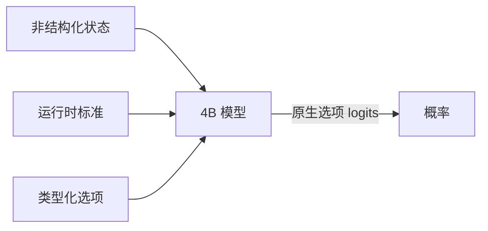

# fastjev

<div align="center">

[English](README.md) | 简体中文


**面向 SDK 的快速、自托管开放模型语义决策工具包。**

*独立维护的 [TheoLeeCJ/SemIf](https://github.com/TheoLeeCJ/SemIf) 分支。*

</div>

> **分支来源与独立性。** fastjev 保留了 [SemIf](https://github.com/TheoLeeCJ/SemIf)（原名 OpenJev）的 Git 历史和 MIT 许可证，同时采用独立路线图。fastjev 与 TheoLeeCJ、TypeSafe 或 Jev 无隶属关系，也未获得其背书。Jev、TypeSafe 及其他名称和商标归各自权利人所有。

## 为什么创建 fastjev

fastjev 按以下优先级推进：

- **SDK 优先：** 面向应用集成的主要接口是公开 Python 包。CLI 继续用于复现、运维和调试。
- **自主迭代：** 维护者可以自行决定发布时间、兼容策略和工程优先级，不必等待上游变更。
- **更快推理：** 将无生成评分、常驻模型服务、经过测量的缓存复用和后端分析作为核心方向。性能变更必须附带可复现证据，不能悄然牺牲决策质量。

更快推理是项目方向，并不表示 fastjev 的每条路径都必然比上游、Jev 或其他服务栈更快或更准确。下文的测量均明确列出硬件、模型、工作负载和已知语义差异。历史基准工件和媒体文件在重命名会破坏校验和或歪曲历史记录时，继续保留 SemIf/OpenJev 名称。

大多数 agent 决策都很小：*路由到哪里*、*是否重试*、*证据是否支持 X*。聊天模型可以回答这些问题，但它会先生成文本，再由软件解析成一个 `if` 语句。

Jev 是 TypeSafe 面向运行时定义语义决策的闭源服务。本项目使用开放模型复现这种**接口模式**，不复现 Jev 未公开的模型或训练方法。

本基线直接读取模型对类型化选项给出的概率，不生成回答句子，不修复 JSON，也没有解码循环。

### 当前重点

- 使用常驻开放模型提供已记录的 System One wire shape。
- 在不暗中改变直接评分语义的前提下降低决策延迟。
- 让模型 revision、基准输入、逐行输出和限制均可审计。

## SDK 快速开始

**Apple Silicon：** 在 macOS arm64 上使用原生 [MLX 后端](docs/MLX.zh-CN.md)，支持直接评分、串行前缀复用和并行共享状态决策。安装 `pip install -e '.[mlx]'`，并在评分命令中加入 `--backend mlx`。

CUDA 路径需要 Python 3.10+，以及一块能容纳 4B BF16 模型的 GPU：

```bash
python -m venv .venv
. .venv/bin/activate
export HF_HOME=/path/to/large-drive/huggingface
pip install -e '.[torch]'
```

让 backend 常驻内存，并通过类型化 SDK 对运行时定义的决策进行评分：

```python
from fastjev import Choice, FastJev, Option

jev = FastJev.from_pretrained(
    "Qwen/Qwen3.5-4B",
    revision="851bf6e806efd8d0a36b00ddf55e13ccb7b8cd0a",
)
result = jev.decide(
    state="Customer cannot access an account after a password reset.",
    question=Choice("Which queue should handle this request?", [
        Option("access", "Account access support."),
        Option("billing", "Billing support."),
    ]),
)
print(result.value, result.probabilities)
jev.close()
```

`FastJev` 只依赖 `ScoringBackend` 协议。内置 Torch、MLX 和可选 vLLM 实现都是适配器，因此切换 runtime 无需改变 `Choice`、`Boolean`、`Score` 或结果类型。通过 vLLM 批量进行 CUDA 推理时安装 `.[vllm]`。安装方式、batching、结果语义、backend 合约和 System One 适配方式见 [Python SDK 指南](docs/SDK.zh-CN.md)。

只有需要 HTTP 边界时，才安装 `.[api]` 并从 `fastjev.http` 导入 `create_app`。

## CLI 与服务封装

在 shell 中运行项目自有示例：

```bash
CUDA_VISIBLE_DEVICES=0 fastjev-score \
  --mode direct \
  --model Qwen/Qwen3.5-4B \
  --revision 851bf6e806efd8d0a36b00ddf55e13ccb7b8cd0a \
  --input examples/decisions.jsonl \
  --output results.jsonl
```

每条结果都包含类型化选项分数、耗时、精确模型 revision 和 prompt hash。

如果所有输入行具有完全相同的状态，可改用 `--mode shared`，只预填充一次状态，再并行评估各项标准。

### System One 兼容 HTTP API

安装 `api` extra 并运行 `fastjev-serve`，即可让一个模型常驻，并提供 `POST /v1/systemone` 和 `GET /v1/models`。适配器接受 TypeSafe 文档中的 `state`、`model` 和 `questions` wire shape，包括 `noul`、`choice` 和 `score` 问题。它不提供 Jev，也不复现 Jev 的校准；请求必须指定已配置的 fastjev 模型。

服务器命令、请求示例、认证方式、置信度定义和兼容边界参见 [System One 兼容 API](docs/SYSTEM_ONE_API.zh-CN.md)。

## 工作原理



- **运行时定义：** 标准和选项说明随请求传入。
- **原生决策：** 一次前向传播直接读取已声明选项的 logits，不采样回答 token。
- **共享状态感知：** 一段较长状态可只预填充一次，再分支到多项标准。
- **可审计：** 仓库提交了项目自有 fixture、精确 runner、逐行输出、revision、prompt 和已知失败。

## 速度

### 直接决策与紧凑生成数组

同一个冻结的 Qwen3.5-4B、同一个项目自有状态、同样 21 项二元标准、同一块 RTX 3090：

| 输出路径 | 时间 | 输出 token | 结果 |
|---|---:|---:|---|
| 直接类型化 logits，3 次中位数 | **1.023 秒** | **0** | 21 对概率 |
| 自回归 JSON 数组，3 次中位数 | 5.332 秒 | 111 | 有效的有序 21 值数组 |

紧凑生成基线只输出按顺序排列的 `"yes"`/`"no"`，不含键、置信度对象或解释。其首 token 中位时间为 0.489 秒，但完成整个数组所需时间是直接读取的 **5.21 倍**。三次数组均有效且完全一致，与直接 argmax 在 21 项标准中的 18 项一致。因此，这是系统层面对比，不表示两种读取方式语义等价。仓库已提交[精确 prompt、输出、token 时间线和运行记录](results/raw/decision-vs-compact-array.json)。

### 在 21 项决策间复用一个状态

项目自有的 37 状态 × 21 标准工作负载：

| 执行路径 | 决策/秒 | 777 项决策耗时 |
|---|---:|---:|
| 全新直接评分 | 2.33 | 333.1 秒 |
| 串行前缀复用 | 10.75 | 72.3 秒 |
| 并行后缀 | **20.03** | **38.8 秒** |
| 原生 reranker | 1.86 | 417.3 秒 |

仓库包含项目自有的 [37×21 fixture](benchmarks/data/shape777.jsonl)、[直接/复用 runner](benchmarks/shape777.py)、[reranker runner](benchmarks/shape777_reranker.py)、[原始计时](results/raw/shape777-direct.json)和[逐行预测](results/raw/shape777-direct.predictions.jsonl)。快速复用路径仍属实验功能：相对全新评分，BF16 执行改变了 777 项 argmax 中的 5–6 项。

## 质量

### 浏览器模型梯度

| 系统 | 浏览器工件 | 下载量 | 自编数据平衡准确率 | 扰动数据平衡准确率 | TypeSafe 子集一致率 |
|---|---|---:|---:|---:|---:|
| Qwen3-0.6B | Q8_0 | 639 MB | 0.440 | 0.528 | 0.407 |
| MiniCPM5-2B | Q4_K_M | 1.56 GB | 0.686 | 0.693 | 0.637 |
| **Qwen3.5-4B** | Q4_K_M | 3.01 GB | **0.813** | **0.766** | 0.845 |
| 已发布 Jev | 闭源托管服务 | — | — | — | **0.883** |

*原生 BF16 分数；浏览器构建使用量化 GGUF。Jev 数值来自 TypeSafe 在相同 102 行子集上发布的结果。*

### 通用决策基线

| 冻结工作负载 | 行数 | 直接 logits（4B） | 原生 reranker（4B） | 已发布 Jev |
|---|---:|---:|---:|---:|
| 自编决策，平衡准确率 | 144 | **0.813** | 0.625 | — |
| WANLI，平衡准确率 | 256 | **0.637** | 0.522 | — |
| TypeSafe 选定子集，众数一致率 | 20 个 case、共 102 行 | **0.845** | 0.560 | 0.883 |
| Every judgment grid，准确率 | 36 | **0.806** | 0.694 | — |
| Every action firewall，组合准确率 | 10 个 action | 0.700 | 0.700 | — |
| Every code retrieval，Recall@1 | 6 个 query | 1.000 | 1.000 | — |
| Every company knowledge，Recall@1 | 7 个 query | 0.929 | 0.929 | — |

reranker 在检索排序上依然很强，但直接 logits 是更好的通用决策基线。

Jev 数值读取自 TypeSafe 发布记录；我们没有调用在线 Jev 端点。比较只覆盖能从公开工件对齐的 102 行，不是 TypeSafe 报告的 711 行汇总。

## 输入

```json
{
  "id": "route-1",
  "state": "Customer cannot access an account after a password reset.",
  "question": "Which queue should handle this request?",
  "options": [
    {"id": "access", "description": "Account access support."},
    {"id": "billing", "description": "Billing support."}
  ]
}
```

返回的概率以所给选项为条件。请在实际决策工作负载上完成校准和验证。`state` 也可以是非空 JSON 对象或数组；直接模式保留其结构化 JSON 形式，reranker 模式则将其渲染成文档文本。

## 中文文档

- [Python SDK](docs/SDK.zh-CN.md) — 类型化决策、backend 协议、batching 和结果语义
- [结果](docs/RESULTS.zh-CN.md) — 质量、速度、扰动测试和声明边界
- [方法](docs/METHOD.zh-CN.md) — 冻结 prompt、指标和计时范围
- [复现](docs/REPRODUCE.zh-CN.md) — 精确环境、固定命令、扰动测试和验证
- [System One 兼容 API](docs/SYSTEM_ONE_API.zh-CN.md) — HTTP 服务、wire format 和兼容边界
- [MLX 后端](docs/MLX.zh-CN.md) — Apple Silicon 安装、缓存语义和证据复现
- [交互回放](demo/index.html)
- [纯浏览器 WebGPU demo](webgpu-demo/index.html)
- [机器可读摘要](results/phase1-summary.json)
- [基准包](benchmarks/README.zh-CN.md) — fixture、runner、选择 ID 和复现命令
- [原始结果与校验和](results/raw/)
- [第三方材料](THIRD_PARTY.zh-CN.md)

## 评估来源

- [TypeSafe 公开评估](https://evals.typesafe.ai/) — 用于选定子集一致率的公开比较 case
- [Every parallel judgment lab](https://typesafe-parallel-judgment-lab.every-4573.chatgpt.site/)及其[可下载实验数据](https://typesafe-parallel-judgment-lab.every-4573.chatgpt.site/downloads/experiments.json)
- [WANLI](https://huggingface.co/datasets/alisawuffles/WANLI) — 外部自然语言推理检查
- [Qwen3-0.6B](https://huggingface.co/Qwen/Qwen3-0.6B)、[MiniCPM5-2B](https://huggingface.co/openbmb/MiniCPM5-2B)、[Qwen3.5-4B](https://huggingface.co/Qwen/Qwen3.5-4B) 和 [Qwen3-Reranker-4B](https://huggingface.co/Qwen/Qwen3-Reranker-4B) — 冻结基线模型

仓库不包含模型权重或第三方源记录。上游模型沿用其各自许可证；项目代码按 [MIT 许可证](LICENSE)发布。

安装发行包和公开 Python 包都名为 `fastjev`；`fastjev-score` 和 `fastjev-serve` 是次级封装。内部 `semif_phase1` 包以及 `semif-score`/`semif-serve` 命令别名仅为兼容继承的脚本和工件而保留。
