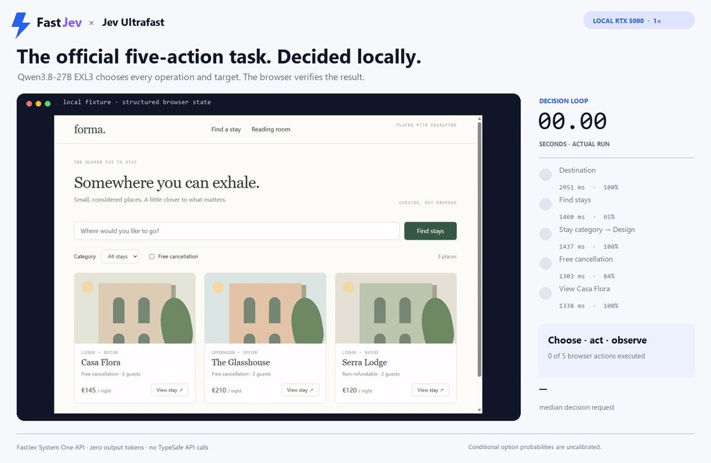

# FastJev × Jev Ultrafast

[English](README.md) | [简体中文](README.zh-CN.md)



这个 demo 将 [Jev Ultrafast](https://github.com/browser-use/jev-ultrafast)
接到 FastJev 的本地 System One 兼容 API。页面观察、带索引的 operation/target
选项构造、浏览器动作执行和再次观察仍由 Jev Ultrafast 完成；录制器只把上游原本
发往 TypeSafe 的 System One 请求转到本地 FastJev。

录制使用 Jev Ultrafast 官方本地旅行 fixture，以及其 `docs/measurement.json`
发布的五个有序目标：

1. 在 Destination 输入 `Lisbon`；
2. 点击 **Find stays**；
3. 把 **Stay category** 设为 **Design**；
4. 启用 **Free cancellation**；
5. 打开 **Casa Flora**。

同一个上游 `Agent` 会把这五条原文作为一个换行分隔的完整任务。录制器没有硬编码
operation、target、字段值或完成结果。FastJev 选中 `TYPE_TEXT` 后，另一个本地文本
模型提供目的地；所有结构化 operation 和 target 决策都来自 FastJev。

## 录制结果

通过验证的录制使用一张 RTX 5090 和下列固定来源：

| 组件 | 精确来源 |
|---|---|
| FastJev runtime 分支 | `240230062901b92fba2ab79d5ecff751369ef7be`，再加本分支的 System One adapter 修改 |
| Jev Ultrafast | `1231850a0bf1a0c0341fe408ef1668dbbfdfac46` |
| 决策模型 | `turboderp/Qwen3.8-27B-exl3`，revision `a35e75a73baee51da709329d19294245cbeeb5d8` |
| 文本辅助模型 | `Qwen/Qwen3.5-4B`，revision `851bf6e806efd8d0a36b00ddf55e13ccb7b8cd0a` |

Agent 完成五个浏览器动作，并在第六次 FastJev 请求返回 `DONE`。从第一次决策请求
到验证完成共 11.776 秒，决策请求延迟中位数为 1.456 秒。第一次请求包含 EXL3
冷路径；独立文本辅助模型用 1.148 秒返回 `Lisbon`。

独立校验器确认最终 URL 为 `#casa-flora`，目的地、Design 分类、已启用的免费取消
筛选和 Casa Flora 详情页全部正确。六次 FastJev 响应的输出 token 都是 0，录制
过程没有调用 TypeSafe API。

这些数字只描述一次集成录制，不是延迟基准；计时不含模型加载和浏览器启动。它不能
与 Jev Ultrafast 的公开数字直接比较，因为两者使用不同的决策模型和文本输入路径。
FastJev 返回的是给定选项条件下的概率，不能当作已校准的决策置信度。

产物：

- [按原速播放的 MP4](assets/fastjev-jev-ultrafast.mp4)
- [GIF 预览](assets/fastjev-jev-ultrafast.gif)
- [海报](assets/fastjev-jev-ultrafast-poster.png)
- [经过验证的动作、决策和 usage 记录](assets/verified-run.json)
- [产物校验和](assets/SHA256SUMS)

13.876 秒的成片在前后分别加入 850 ms 引入和 1.25 秒结果停留；其中 11.776 秒
的浏览器运行保持 1× 原速。

## 复现

在隔离环境安装 FastJev runtime-capabilities 分支及 EXL3、API 依赖：

```bash
git checkout 240230062901b92fba2ab79d5ecff751369ef7be
python -m venv .venv
. .venv/bin/activate
pip install -e '.[test,torch,api,exl3]'
```

只暴露一张 GPU，并启动常驻决策模型：

```bash
CUDA_VISIBLE_DEVICES=0 fastjev-serve \
  --backend exl3 \
  --model turboderp/Qwen3.8-27B-exl3 \
  --revision a35e75a73baee51da709329d19294245cbeeb5d8 \
  --exl3-cache-size 8192 \
  --exl3-gpu-split 22.5 \
  --served-model fastjev-qwen3.8-27b-exl3 \
  --served-model-description 'FastJev direct option logits on Qwen3.8-27B EXL3' \
  --served-model-release-date 2026-09-22 \
  --host 127.0.0.1 \
  --port 8000 \
  --allow-unauthenticated
```

检出录制所用的 Jev Ultrafast revision，安装锁定环境，再启动仅监听回环地址的
fixture server：

```bash
git clone https://github.com/browser-use/jev-ultrafast.git
cd jev-ultrafast
git checkout 1231850a0bf1a0c0341fe408ef1668dbbfdfac46
uv sync
uv run python -m jev_ultrafast.demo
```

在 8001 端口为固定的 Qwen3.5-4B snapshot 启动 OpenAI-compatible 文本接口。
使用独立 profile 启动带 CDP 端口的 Chrome 或 Edge，再把
`http://127.0.0.1:9222/json/version` 返回的 `webSocketDebuggerUrl` 写入
`BU_CDP_WS`。

从 Jev Ultrafast 环境运行录制器；输出目录必须尚不存在：

```bash
uv run python /path/to/fastjev/demo/jev-ultrafast/record.py /new/run-directory \
  --case travel \
  --end-to-end \
  --model fastjev-qwen3.8-27b-exl3 \
  --model-source turboderp/Qwen3.8-27B-exl3 \
  --model-revision a35e75a73baee51da709329d19294245cbeeb5d8 \
  --text-model /path/to/Qwen3.5-4B \
  --fastjev-revision 240230062901b92fba2ab79d5ecff751369ef7be \
  --jev-ultrafast-revision 1231850a0bf1a0c0341fe408ef1668dbbfdfac46
```

只有在上游 Agent 到达 `done`、旅行任务的每项校验都通过、FastJev 决策输出 token
为 0、没有 TypeSafe 调用，并且录屏没有错误时，录制器才接受这次运行。

安装 Pillow 和 FFmpeg 后，把结果渲染到新的输出路径：

```bash
uv run --with pillow python /path/to/fastjev/demo/jev-ultrafast/render.py \
  /new/run-directory /new/render/fastjev-jev-ultrafast.mp4 \
  --gif /new/render/fastjev-jev-ultrafast.gif \
  --poster /new/render/fastjev-jev-ultrafast-poster.png
```

验证已提交的产物：

```bash
cd demo/jev-ultrafast/assets
sha256sum -c SHA256SUMS
```
